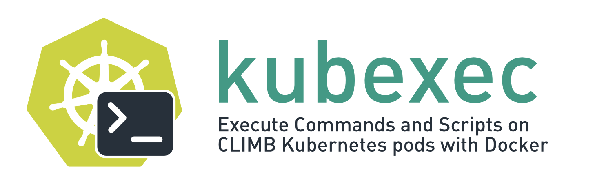

# kubexec




Execute commands and scripts on Kubernetes pods with Docker access.

Designed for use in [CLIMB Notebooks](https://docs.climb.ac.uk/).

## Installation

```bash
pip install -e .
```

## Usage

```bash
kubexec [-h] [-d DOCKER_IMAGE] [-n NAMESPACE] [-p POD_NAME] 
        [-m MEMORY] [-c CPU] [-w WORKDIR] [-v VOLUME_MOUNT]
        [--config CONFIG] [--context CONTEXT] [--create-pod]
        [--cleanup] [--verbose] [--dry-run] TARGET
```

## Examples

```bash
# Run a simple command
kubexec 'echo "Hello, Kubernetes!"'

# Use specific Docker image
kubexec -d python:3.9 'python -c "import sys; print(sys.version)"'

# Run with resource limits
kubexec -m 4Gi -c 2 'stress --cpu 2 --timeout 60s'

# Execute script file
kubexec ./my_script.sh

# Use existing pod
kubexec -p my-existing-pod 'ls -la'

# Volume mounting
kubexec -v /host/data:/pod/data 'ls /pod/data'

# Save output to local files (works like local commands)
kubexec "ls -la > output.txt"

# Bioinformatics example with SPAdes genome assembler
# This will create spades-out/ directory in your current working directory
kubexec -d community.wave.seqera.io/library/spades:4.1.0--77799c52e1d1054a \
    "spades.py -1 tests/reads/s_6_1.fastq.gz -2 tests/reads/s_6_2.fastq.gz -o spades-out"
```